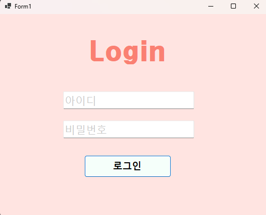
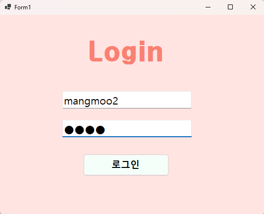
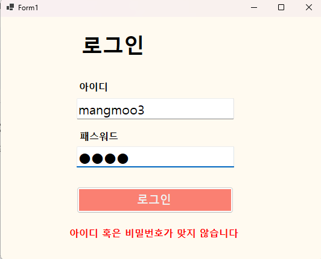
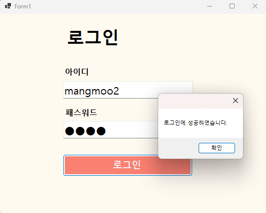
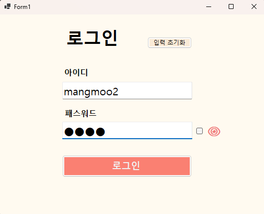
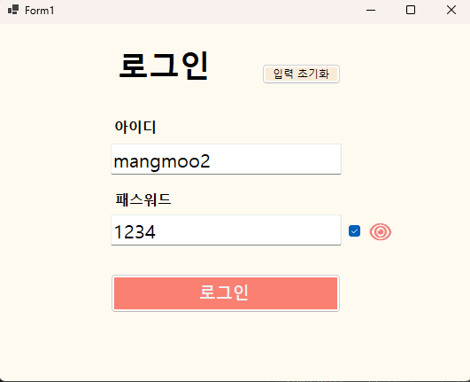
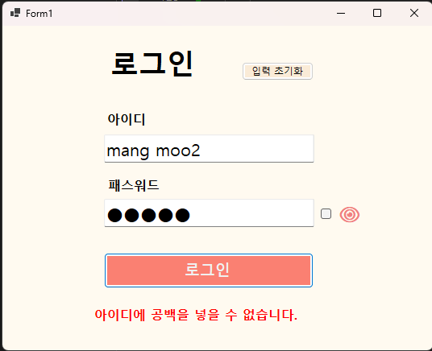
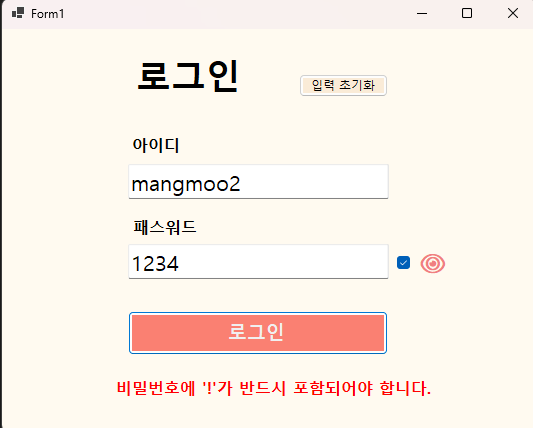
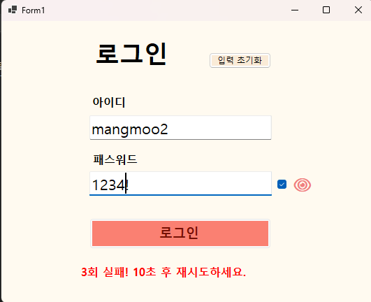

# (c#코딩) 로그인화면 (Login Screen) 

##개요 
-c# 프로그래밍 학습
-설명 : 사용자 아이디와 비밀번호를 입력받아 유효성을 검사하고, 보안 및 편의 기능을 제공하는 로그인 인증 프로그램
-사용한 플랫폼 : net windows forms, visual studio, git hub 
-사용한 컨트롤 : Label 3개(제목, 에러 메시지 등), TextBox 2개(아이디, 패스워드), Button 2개(로그인, 초기화), 
CheckBox 1개(비밀번호 보기), Timer 1개(입력 제한용)
-사용한 기술과 구현한 기능 : 
 -  컨트롤 배치와 기본적인 속성 제어 
 -  데이터 처리 및 연산 로직
 -  문자열 처리 및 동적 텍스트 결합
 -  사용자 편의 기능 (수정/삭제/보안)

   ## 실행 화면 (과제 1)
   -과제 1 코드의 실행 스크린

   

   
   
   
  #과제내용
   
     -컨트롤 배치와 기본적인 속성 설정 
   
     -Placeholder로 입력창 안내하는 기능 구현
   
     -아이디와 패스워드 처리 기능 구현
   
   
   #구현 내용과 기능 설명

    - TextBox(아이디, 패스워드), Button(로그인) 등을 적절히 배치

    - Placeholder 표시

    - 로그인 가능 여부 체크 기능

    - 로그인 성공/실패 메시지 박스 보여주기

   ## 실행 화면 (과제 )
   -과제  코드의 실행 스크린

   

   
   
   
  #과제내용
   
     -아이디 또는 패스워드가 잘못 입력 되었을때 에러 메시지 보여주기
   
     -MessageBox를 띄우지 말고 아이디와 패스워드를 입력하는곳에 보여주기
   
     -UX 개선하기

   
   #구현 내용과 기능 설명

    - Label 컨트롤추가

    - Visible 속성을 이용해서 메시지 보이기와 숨기기 기능 구현

    - UX개선

   ## 실행 화면 (과제 3)
   -과제 3 코드의 실행 스크린

   

   
   
   
  #과제내용
   
     -아이디와 패스워드를 빠르게 입력하고 로그인 할 수 있도록
   
     -사용하기 편하게 만들기

   
   #구현 내용과 기능 설명

    - Enter키를 치면 로그인 되도록 포커스 흐름 정리

    - 전체를 지우는 기능 구현하기
     
    - 패스워드를 보여주는 기능 구현하기

   ## 실행 화면 (과제 4)
   -과제 4 코드의 실행 스크린

   

   

   
   
   
  #과제내용
   
     -아이디와 패스워드 입력 문자 확인
   
     -로그인 시도 회수 제한 (2단계 확인 절차 추가)
   
   
   #구현 내용과 기능 설명

    - 아이디에 넣을수 없는 글자 체크

    - 비밀번호에 넣을 수 없거나 꼭 들어가야 하는 문자 체크

    - 일정 회수가 지나면 정해진 시간후에 재시도 가능하게

   #배운내용

    - KeyDown, Tick, CheckedChanged 등 다양한 이벤트를 연결하며 사용자의 동작에 실시간으로 반응하는 프로그램의 구조를 
    이해하게 되었습니다.

    - 단순히 "기능만 되면 된다"는 생각에서 벗어나, Enter 키 하나로 다음 칸으로 이동하거나 
    비밀번호를 눈으로 확인하는 기능이 사용자에게 얼마나 큰 편의를 주는지 배웠습니다.